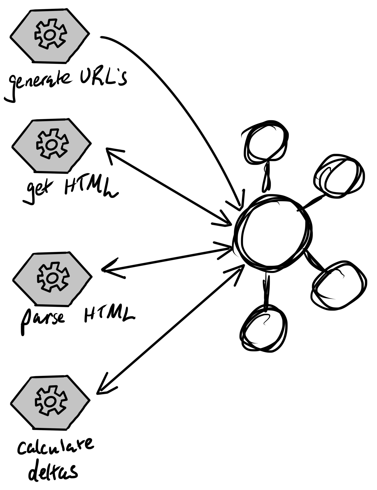
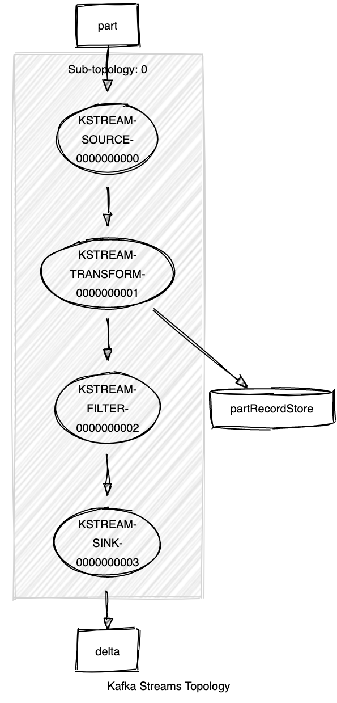

# inventory tracker microservices

[//]: # (TODO: add narrative)

[//]: # (TODO: convert to Avro)

[//]: # (TODO: change diagram to show which services are Spring, Kafka Streams, etc...)

[//]: # (TODO: add link to slides)

[//]: # (TODO: video)

## calculate deltas

Because the _calculate deltas_ step is stateful, this is done using Kafka Streams. A state store keeps the previous inventory quantity for each part. This state store is backed by Kafka so, in the event the Kafka Streams job is stopped or fails, it can be restarted without losing any state.

